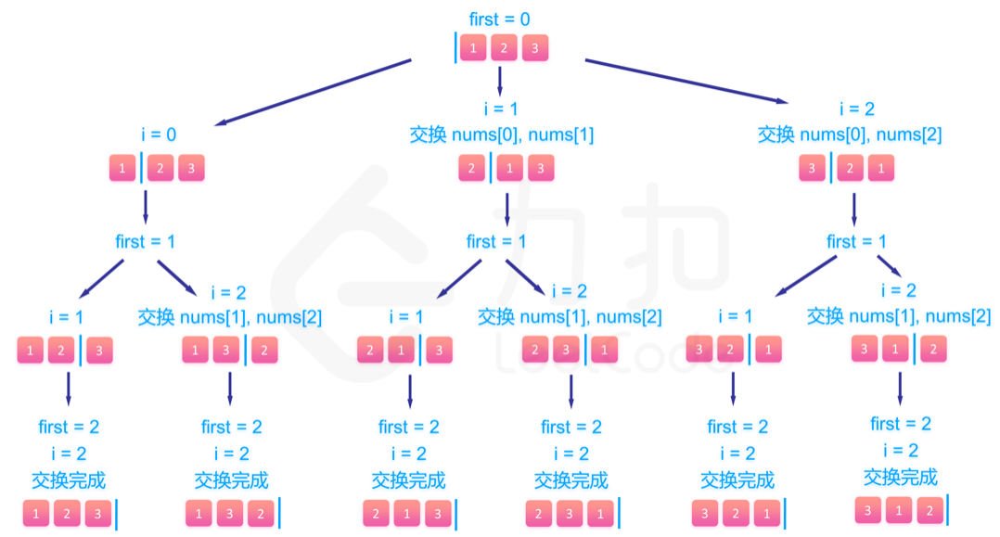

# 题目描述
46. 全排列

给定一个 没有重复 数字的序列，返回其所有可能的全排列。

## 示例:

输入: [1,2,3]
输出:
[
  [1,2,3],
  [1,3,2],
  [2,1,3],
  [2,3,1],
  [3,1,2],
  [3,2,1]
]


# 解题思路
搜索问题 dfs/bfs

```
class Solution:
    def permute(self, nums: List[int]) -> List[List[int]]:
```

## plan 1
递归 本地详见下图


```
res = []
l = len(nums)
if l<2:
	return [nums]
else:
	for i in range(l):
		others = nums[:i]+nums[i+1:]
		for j in self.permute(others):
			res.append([nums[i]]+j)
return res # return res.append([nums[i]]+j) 会发生神奇的事情哦
```
### 执行效率
执行用时 :44 ms, 在所有 Python3 提交中击败了63.51%的用户
内存消耗 :13.7 MB, 在所有 Python3 提交中击败了5.41%的用户

## plan 2
