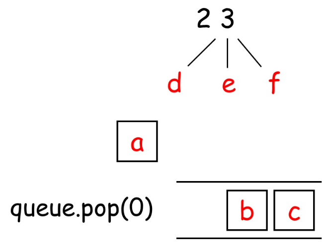
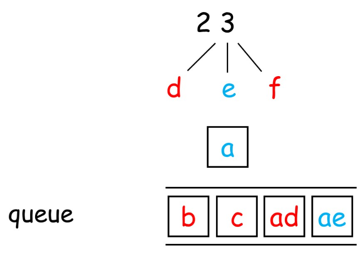

# 题目描述

给定一个仅包含数字 2-9 的字符串，返回所有它能表示的字母组合。
给出数字到字母的映射如下（与电话按键相同）。注意 1 不对应任何字母。


## 示例:

输入："23"
输出：["ad", "ae", "af", "bd", "be", "bf", "cd", "ce", "cf"].

## 说明:
尽管上面的答案是按字典序排列的，但是你可以任意选择答案输出的顺序。

# 解题思路
是个排列问题 字典映射 递归 队列


## plan 1
动态规划

```
class Solution:
    def letterCombinations(self, digits: str) -> List[str]:
        if not digits: return []

        map_dic = {'1':'','2':'abc','3':'def','4':'ghi','5':'jkl','6':'mno','7':'pqrs','8':'tuv','9':'wxyz','0':'_'}
        ans = ['']
        for v in digits:
            ans = [i+j for i in ans for j in map_dic[v]]
        return ans
```
### 执行效率


## plan 2
队列


```
class Solution:
    def letterCombinations(self, digits: str) -> List[str]:
        if not digits: return []
        phone = ['abc','def','ghi','jkl','mno','pqrs','tuv','wxyz']
        queue = ['']  # 初始化队列
        for digit in digits:
            for _ in range(len(queue)):
                tmp = queue.pop(0)
                for letter in phone[ord(digit)-50]:# 这里我们不使用 int() 转换字符串，使用ASCII码
                    queue.append(tmp + letter)
        return queue

```

# plan 3
递归 回溯
